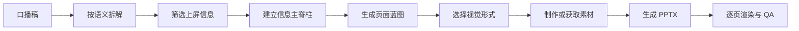

# spoken-script-to-ppt

把“先有口播稿，再做 PPT”变成一套稳定、可复用的视觉化工作流。

> A community Codex Skill that turns a finished Chinese spoken script into a sparse, visual-first, narration-synced presentation.

这个项目不会把口播稿逐段搬上幻灯片。它先识别演讲主线，筛选必须上屏的信息，再为每页选择真实照片、编辑插画、图表、图解或统一图标，最后生成一份为口播服务的视觉型演示文稿。

## 它解决什么问题

常见流程是：

```text
先做 PPT → 再根据 PPT 写口播稿
```

这个 Skill 处理相反流程：

```text
先完成口播稿 → 提炼视觉主线 → 制作 PPT
```

| PPT 负责 | 口播负责 |
|---|---|
| 结论、结构、证据、关系、步骤、行动 | 解释、铺垫、故事、情绪、例子、细节 |

理想结果是：

- 静音浏览 PPT，仍能看懂整场演讲的逻辑主线；
- 只听口播，内容仍然完整；
- 两者结合时，画面提供文字与口述无法替代的理解和记忆。

## 工作流程



内容会被分成五类：

- `OWN_SLIDE`：独立成页的结论、证据、步骤、警告或行动。
- `MERGE`：直接支持相邻核心页面的信息。
- `VISUAL_ONLY`：适合转成场景、动作、情绪或隐喻画面。
- `ORAL_ONLY`：保留在口播或演讲者备注中，不上屏。
- `EXCLUDE`：寒暄、口头填充、重复表达或制作提示。

## 功能亮点

- 不按自然段机械分页，而是按“认知任务”组织页面。
- 普通页面正文原则上不超过 40 个汉字。
- 根据内容关系选择照片、插画、图表、流程图、关系图或图标。
- 真实人物、产品、界面和案例优先使用真实且有权使用的素材。
- 抽象概念、机制、情绪和隐喻使用现代编辑漫画或商业插画。
- 只有存在可追溯数据时才制作数据图表，不编造数字。
- 使用同一家族的成熟 SVG 图标，不使用 Emoji 或 AI 伪图标。
- 将原稿范围、翻页锚点、口播补充内容和来源写入 speaker notes。
- 最终 PPTX 需要经过逐页渲染、全尺寸检查和整套节奏检查。

## 安装

### 方法一：作为 Plugin 安装（推荐）

先把本仓库添加为自定义 marketplace：

```bash
codex plugin marketplace add Aiysae/spoken-script-to-ppt
```

随后重启 ChatGPT 桌面应用，打开 Plugins Directory，选择“口播稿视觉 PPT”来源并安装 `spoken-script-to-ppt`。

这是 GitHub 自定义 marketplace，不是 OpenAI 官方 Plugins Directory。

### 方法二：使用 `$skill-installer`

在 Codex 中输入：

```text
$skill-installer

请安装这个 Skill：
https://github.com/Aiysae/spoken-script-to-ppt/tree/main/plugins/spoken-script-to-ppt/skills/spoken-script-to-ppt
```

安装完成后，Skill 会在下一轮对话中可用；若没有出现，重启 Codex。

### 方法三：手动安装

```bash
git clone https://github.com/Aiysae/spoken-script-to-ppt.git
mkdir -p ~/.agents/skills
cp -R \
  spoken-script-to-ppt/plugins/spoken-script-to-ppt/skills/spoken-script-to-ppt \
  ~/.agents/skills/spoken-script-to-ppt
```

`~/.agents/skills` 是官方当前推荐的用户级本地 Skill 目录。

## 使用

直接生成 PPT：

```text
$spoken-script-to-ppt

这是我的口播稿：
[粘贴完整口播稿]

请直接生成一份 16:9 PPT。
```

先查看拆解和页面方案：

```text
$spoken-script-to-ppt

先不要生成 PPT，请先输出：
1. 原稿地图
2. 内容筛选结果
3. 页面蓝图
4. 每页视觉素材计划

口播稿如下：
[粘贴完整口播稿]
```

## 视觉路由

| 内容类型 | 首选视觉 |
|---|---|
| 真实人物、企业、产品、地点、事件 | 有权使用的真实照片、官方素材或截图 |
| 抽象概念、情绪、隐喻 | 编辑漫画或商业插画 |
| 可靠的趋势、比例、比较数据 | 数据图表 |
| 没有数字的比较 | A/B 插画或并列场景 |
| 流程、时间、因果、层级 | 流程图、时间线或关系图 |
| 3–5 个分类或功能 | 同一家族的矢量图标 |
| 核心观点或金句 | 重点文字加一个辅助视觉 |

“漫画感”可以体现在配色、描边、圈注和颗粒上，但不能扭曲真实照片、品牌信息或数据比例。

## 依赖与降级

完整生成 `.pptx` 时，目标 Codex 环境需要：

- Skills 支持；
- 可用的 `Presentations` Skill，用于创建、渲染和验收 PPTX；
- 生成解释型插画时可用的 `imagegen` Skill；
- 核验实时事实、数据或素材来源时可访问网络。

如果缺少演示文稿或图像生成能力，本 Skill 仍可拆解口播稿、筛选内容、生成页面蓝图和视觉提示词，但不会假装已经生成最终 PPTX 或图片。

## 当前限制

- 输入应是已经写好的文字口播稿；不负责原始音频或视频转写。
- 中文口播稿是主要适用场景，其他语言尚未系统测试。
- 没有可靠数据时不会生成看似精确的数据图表。
- AI 生成插画只能作为解释性视觉，不能冒充真实人物、产品、事件或证据。
- 本项目不会替用户取得第三方图片、字体、Logo、数据或模板的授权。
- 医疗、法律、金融和安全等高风险关键主张无法核验时，不应包装成已证实结论。

## GitHub、搜索与官方目录

GitHub 公共仓库意味着源码可以被搜索、访问、fork、clone 和安装，但不等于 Codex 会自动发现或启用这个 Skill。

用户仍需要通过自定义 marketplace、`$skill-installer` 或手动复制完成安装。要进入 ChatGPT 与 Codex 共用的官方 Plugins Directory，需要把 skills-only plugin 提交到 OpenAI Platform，经过审核并由发布者主动发布；本仓库目前是社区项目，未声称获得 OpenAI 官方背书。

相关官方文档：

- [Build skills](https://learn.chatgpt.com/docs/build-skills)
- [Package your plugin](https://developers.openai.com/plugins/build/plugins)
- [Submit plugins](https://developers.openai.com/plugins/deploy/submission)

## 仓库结构

```text
.
├── .agents/plugins/marketplace.json
├── plugins/spoken-script-to-ppt
│   ├── .codex-plugin/plugin.json
│   └── skills/spoken-script-to-ppt
│       ├── SKILL.md
│       ├── agents/openai.yaml
│       └── references/
├── README.md
├── CONTRIBUTING.md
├── CHANGELOG.md
└── LICENSE
```

## 贡献

欢迎通过 Issue 或 Pull Request 提交真实场景下的失败案例、内容筛选改进、视觉路由规则和其他语言适配。具体要求见 [CONTRIBUTING.md](CONTRIBUTING.md)。

## License

本项目采用 [MIT License](LICENSE)。Skill 说明文件受 MIT 许可；实际使用中取得或生成的照片、图标、字体、Logo、数据和其他第三方素材仍受各自来源与授权条款约束。

## English

`spoken-script-to-ppt` is a community Codex Skill for turning an existing Chinese spoken script into a sparse, visual-first presentation workflow. It distills key messages, keeps explanations in narration, routes each slide to an appropriate visual form, writes script cues into speaker notes, and validates the final deck through rendering and visual QA.
